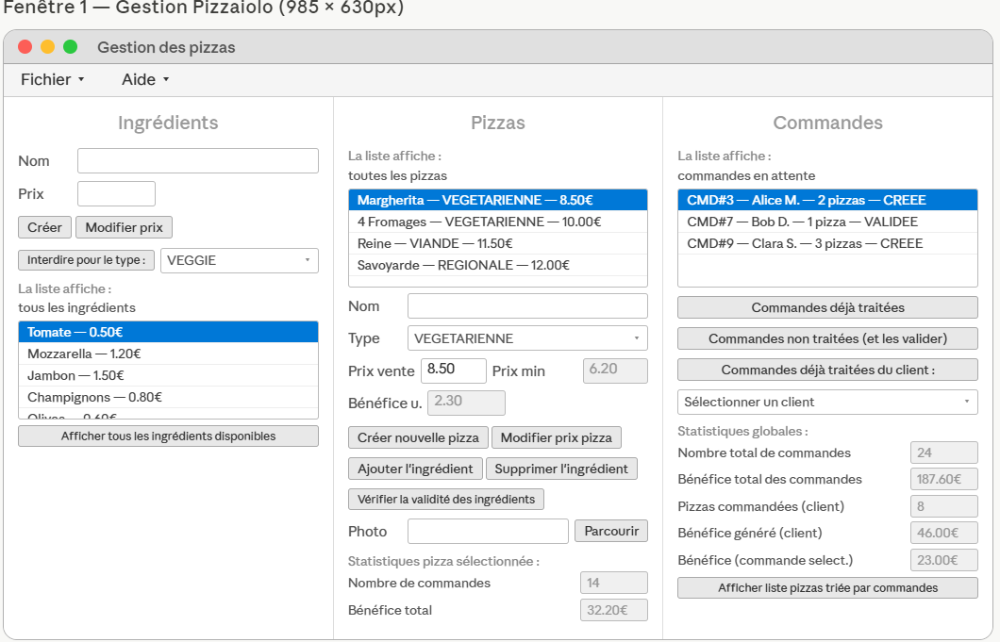
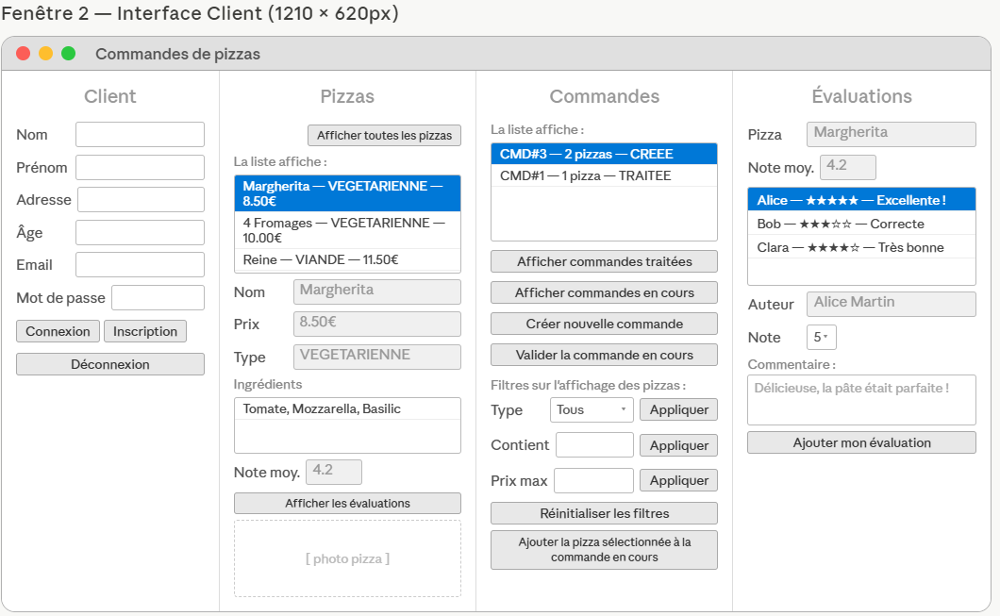

# 🍕 Pizza del Arte — Application de gestion de pizzeria

Application Java modulaire développée dans le cadre de la Licence Informatique (UBO) pour gérer une pizzeria : pizzas, ingrédients, commandes clients et évaluations.

---

## 📸 Aperçu de l'application

> L'application s'ouvre avec **deux fenêtres simultanées** :

### Fenêtre Pizzaiolo — Gestion du restaurant
Interface réservée au gérant. Divisée en 3 panneaux :
- **Ingrédients** : créer, modifier le prix, interdire un ingrédient selon le type de pizza
- **Pizzas** : créer des pizzas, ajouter/supprimer des ingrédients, vérifier la validité, voir les bénéfices
- **Commandes** : visualiser les commandes en attente ou traitées, statistiques globales par client

### Fenêtre Client — Espace client
Interface pour les clients. Divisée en 4 panneaux :
- **Client** : inscription, connexion, déconnexion
- **Pizzas** : liste des pizzas disponibles, filtres (type, ingrédient, prix max), affichage photo
- **Commandes** : créer une commande, ajouter des pizzas, valider
- **Évaluations** : consulter les avis, noter et commenter une pizza

---

## 🛠️ Technologies utilisées

| Technologie | Usage |
|-------------|-------|
| Java 21 | Langage principal |
| JavaFX | Interface graphique (FXML) |
| JUnit | Tests unitaires |
| Git | Gestion de version |
| Checkstyle | Contrôle qualité du code |
| Javadoc | Documentation |
| XML | Sauvegarde/chargement des données |

---

## 🏗️ Architecture du projet

```
src/
├── MainPizzas.java          # Point d'entrée
├── pizzas/                  # Modèle métier
│   ├── Pizza.java           # Classe Pizza (nom, type, ingrédients, prix, évaluations)
│   ├── Ingredient.java      # Classe Ingrédient
│   ├── Commande.java        # Commande (CREEE → VALIDEE → TRAITEE)
│   ├── Client.java          # Client avec authentification
│   ├── Pizzaiolo.java       # Gérant (implémente InterPizzaiolo)
│   ├── Evaluation.java      # Évaluation (note + commentaire)
│   ├── TypePizza.java       # Enum : VIANDE, VEGETARIENNE, REGIONALE
│   ├── InterPizzaiolo.java  # Interface métier pizzaiolo
│   ├── InterClient.java     # Interface métier client
│   └── ...exceptions        # CommandeException, NonConnecteException
├── ui/                      # Interface graphique JavaFX
│   ├── MainInterface.java   # Lanceur des deux fenêtres
│   ├── PizzaioloControleur  # Contrôleur fenêtre pizzaiolo
│   ├── ClientControleur     # Contrôleur fenêtre client
│   ├── pizzaiolo.fxml       # Layout fenêtre pizzaiolo
│   ├── client.fxml          # Layout fenêtre client
│   └── JeuDeDonnees.java    # Données de test au démarrage
├── io/                      # Persistance
│   ├── SauvegardeFichier    # Sauvegarde/chargement XML
│   └── InterSauvegarde      # Interface de persistance
└── tests/                   # Tests JUnit
    ├── PizzaTest.java
    ├── CommandeTest.java
    ├── TestPizzaiolo.java
    └── ...
```

---

## ⚙️ Fonctionnalités principales

### Côté Pizzaiolo
- ✅ Créer/modifier des ingrédients avec prix
- ✅ Interdire un ingrédient pour un type de pizza donné
- ✅ Créer des pizzas avec type (Viande / Végétarienne / Régionale)
- ✅ Ajouter des ingrédients à une pizza et vérifier leur validité
- ✅ Suivre les bénéfices par pizza et globalement
- ✅ Valider les commandes en attente
- ✅ Voir les commandes par client
- ✅ Afficher les pizzas triées par nombre de commandes
- ✅ Sauvegarder / charger les données (XML)

### Côté Client
- ✅ S'inscrire et se connecter
- ✅ Consulter la liste des pizzas avec filtres (type, ingrédient, prix max)
- ✅ Créer une commande et y ajouter des pizzas
- ✅ Valider une commande
- ✅ Laisser une évaluation (note + commentaire) sur une pizza
- ✅ Voir les évaluations et la note moyenne

---

## 🚀 Lancer le projet

### Prérequis
- Java 21+
- JavaFX SDK (à configurer dans le build path)

### Compilation & exécution
```bash
# Compiler depuis le dossier src/
javac --module-path /path/to/javafx/lib --add-modules javafx.controls,javafx.fxml -d out src/**/*.java

# Lancer
java --module-path /path/to/javafx/lib --add-modules javafx.controls,javafx.fxml -cp out ui.MainInterface
```

> ℹ️ Le projet a été développé et testé sous **Eclipse** avec JavaFX configuré via le build path du projet.

## 📸 Aperçu de l'application

### Fenêtre Pizzaiolo — Gestion du restaurant


### Fenêtre Client — Espace client

---

## 🧪 Tests unitaires

Les tests JUnit couvrent les classes du modèle :

```bash
# Classes testées :
# - PizzaTest.java        → création, ingrédients, prix
# - CommandeTest.java     → états, ajout pizzas, bénéfice
# - TestPizzaiolo.java    → gestion globale, statistiques
# - TestIngredient.java   → création, prix, restrictions
# - TestEvaluation.java   → note, commentaire, moyenne
# - TestInformationPersonnelle.java → données client
```

---

## 👨‍💻 Auteur

**Abdallah Maammar**
- 🌐 [Portfolio](https://abdallah-76.github.io)
- 💼 [LinkedIn](https://www.linkedin.com/in/abdallah-maammar-930860326/)
- 🔗 [GitHub](https://github.com/abdallah-76)

---

## 📄 Licence

Projet académique — Université de Bretagne Occidentale (UBO) · Licence Informatique L3
